# 四足机器人状态估计算法详解

## 摘要

本文档系统阐述四足机器人状态估计的核心理论与实现方法。以误差状态卡尔曼滤波器（ESKF）为核心框架，详细推导了基于激光雷达-惯性-运动学紧耦合的状态估计算法，包括完整的数学模型、传感器融合策略、误差传播机制及工程实现细节。本文档为Leg-KILO项目的核心技术参考，旨在为四足机器人自主导航与运动控制提供精确可靠的状态估计支撑。

**关键词**：四足机器人、状态估计、误差状态卡尔曼滤波、传感器融合、SLAM

---

## 目录

1. [绪论](#1-绪论)
2. [四足机器人状态估计基础](#2-四足机器人状态估计基础)
3. [传感器系统与数据特性](#3-传感器系统与数据特性)
4. [误差状态卡尔曼滤波器原理](#4-误差状态卡尔曼滤波器原理)
5. [ESKF数学推导与实现](#5-eskf数学推导与实现)
6. [算法实现与关键技术细节](#6-算法实现与关键技术细节)
7. [性能分析与算法对比](#7-性能分析与算法对比)
8. [结论与展望](#8-结论与展望)
9. [参考文献](#参考文献)

---

## 1. 绪论

### 1.1 研究背景与意义

四足机器人作为仿生机器人的重要分支，具有卓越的地形适应能力和运动灵活性，在灾难救援、物资运输、科学探索等领域展现出广阔的应用前景。状态估计作为机器人自主导航与运动控制的基础，其精度和鲁棒性直接决定了机器人的整体性能。

**状态估计的核心任务**包括：
- 实时估计机器人在三维空间中的位置和姿态
- 准确估计机器人的运动速度和加速度
- 估计传感器的系统性误差（如IMU偏置）
- 提供估计不确定性的量化指标

### 1.2 四足机器人状态估计的特殊挑战

与轮式机器人和飞行器相比，四足机器人的状态估计面临独特的挑战：

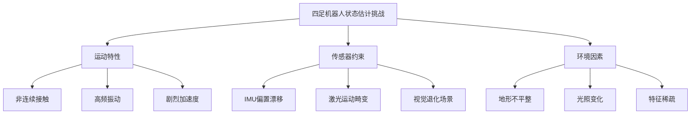

**主要挑战分析**：

| 挑战类型 | 具体表现 | 对状态估计的影响 |
|---------|---------|----------------|
| 非连续接触 | 足端与地面接触状态频繁切换 | 运动学约束不稳定 |
| 高频振动 | 步态周期内的机械振动 | IMU测量噪声增大 |
| 剧烈加速度 | 跳跃、快速转向等动作 | 线性化误差增大 |
| 运动畸变 | 激光扫描期间机器人运动 | 点云配准误差 |
| 传感器漂移 | 长时间运行的累积误差 | 全局一致性下降 |

### 1.3 本文主要贡献

本文档系统总结了Leg-KILO项目中四足机器人状态估计的核心算法，主要贡献包括：

1. **理论框架**：建立了完整的ESKF状态估计理论体系
2. **多源融合**：实现了激光-惯性-运动学的紧耦合融合
3. **误差建模**：详细推导了各传感器误差传播模型
4. **工程实现**：提供了可复用的算法实现方案

---

## 2. 四足机器人状态估计基础

### 2.1 基本概念与定义

#### 2.1.1 状态向量定义

四足机器人的状态向量 $\mathbf{x}$ 定义为：

$$\mathbf{x} = \begin{bmatrix} \mathbf{R} & \mathbf{p} & \mathbf{v} & \mathbf{b}_a & \mathbf{b}_g & \mathbf{g} \end{bmatrix}^T$$

其中各分量含义如下：

| 符号 | 维度 | 含义 | 坐标系 |
|------|------|------|--------|
| $\mathbf{R} \in SO(3)$ | 3×3 | 旋转矩阵 | 世界系相对机体系 |
| $\mathbf{p} \in \mathbb{R}^3$ | 3×1 | 位置向量 | 世界系 |
| $\mathbf{v} \in \mathbb{R}^3$ | 3×1 | 速度向量 | 世界系 |
| $\mathbf{b}_a \in \mathbb{R}^3$ | 3×1 | 加速度计偏置 | 机体系 |
| $\mathbf{b}_g \in \mathbb{R}^3$ | 3×1 | 陀螺仪偏置 | 机体系 |
| $\mathbf{g} \in \mathbb{R}^3$ | 3×1 | 重力向量 | 世界系 |

#### 2.1.2 坐标系定义

系统涉及多个坐标系的转换：

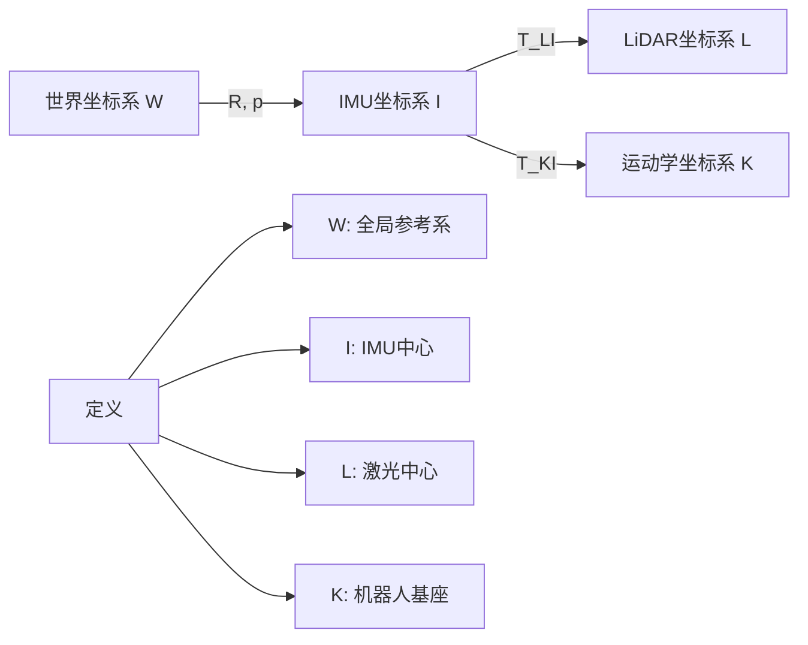

**坐标系变换关系**：

$$\mathbf{p}_W = \mathbf{R}_{WI} \mathbf{p}_I + \mathbf{t}_{WI}$$

$$\mathbf{p}_I = \mathbf{R}_{IL} \mathbf{p}_L + \mathbf{t}_{IL}$$

其中 $\mathbf{R}_{IL}$ 和 $\mathbf{t}_{IL}$ 为LiDAR到IMU的外参。

### 2.2 状态估计的重要性

状态估计在四足机器人系统中扮演核心角色：

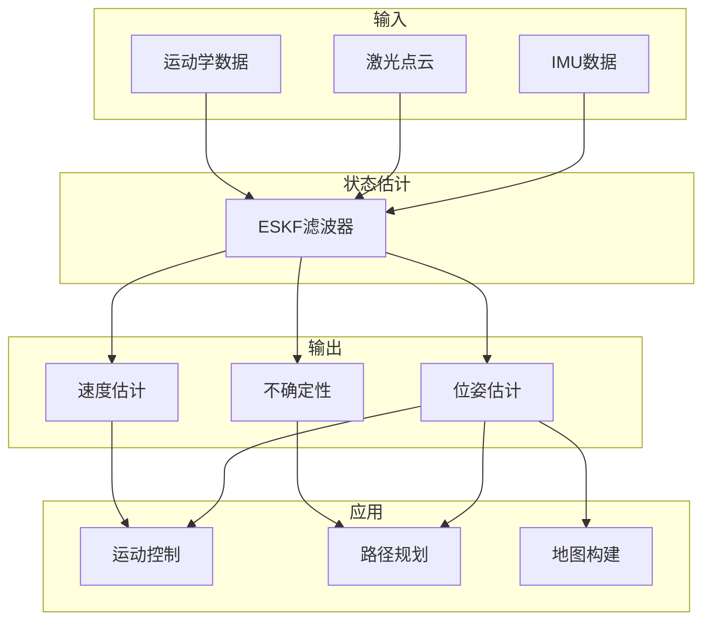

**关键应用场景**：

1. **运动控制**：提供实时位姿反馈，支撑平衡控制和步态规划
2. **路径规划**：提供全局定位信息，支持导航决策
3. **地图构建**：提供准确的位姿变换，实现一致性建图
4. **故障检测**：通过估计不确定性识别异常状态

### 2.3 状态估计问题分类

根据观测信息的不同，状态估计问题可分为以下几类：

| 问题类型 | 观测信息 | 典型方法 | 特点 |
|---------|---------|---------|------|
| 纯惯性导航 | 仅IMU | 积分递推 | 短期精度高，长期漂移严重 |
| 激光里程计 | 激光+IMU | LOAM系列 | 结构环境精度高 |
| 视觉里程计 | 相机+IMU | VINS系列 | 纹理丰富环境效果好 |
| 多源融合 | 激光+视觉+IMU+运动学 | LVI-SAM, Leg-KILO | 鲁棒性最强 |

---

## 3. 传感器系统与数据特性

### 3.1 惯性测量单元（IMU）

#### 3.1.1 IMU测量模型

IMU测量包含加速度计和陀螺仪两部分：

**加速度计测量模型**：

$$\mathbf{a}_{meas} = \mathbf{R}^T(\mathbf{a}_{true} - \mathbf{g}) + \mathbf{b}_a + \mathbf{n}_a$$

**陀螺仪测量模型**：

$$\boldsymbol{\omega}_{meas} = \boldsymbol{\omega}_{true} + \mathbf{b}_g + \mathbf{n}_g$$

其中：
- $\mathbf{b}_a, \mathbf{b}_g$：加速度计和陀螺仪偏置
- $\mathbf{n}_a, \mathbf{n}_g$：高斯白噪声

#### 3.1.2 IMU误差特性

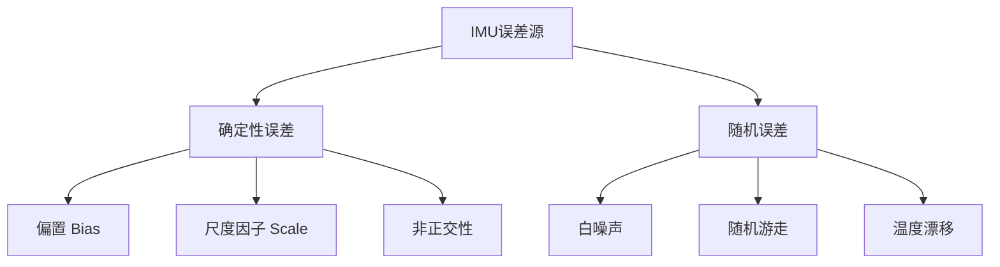

**误差参数定义**：

| 参数 | 符号 | 典型值 | 说明 |
|------|------|--------|------|
| 加速度计白噪声 | $\sigma_a$ | 0.01-0.1 m/s²/√Hz | 高频噪声 |
| 陀螺仪白噪声 | $\sigma_g$ | 0.001-0.01 rad/s/√Hz | 高频噪声 |
| 加速度计偏置随机游走 | $\sigma_{b_a}$ | 0.0001 m/s³/√Hz | 偏置稳定性 |
| 陀螺仪偏置随机游走 | $\sigma_{b_g}$ | 0.00001 rad/s²/√Hz | 偏置稳定性 |

#### 3.1.3 IMU预积分

为提高计算效率，采用IMU预积分技术：

**相对运动约束**：

$$\Delta \mathbf{R}_{ij} = \prod_{k=i}^{j-1} \text{Exp}((\boldsymbol{\omega}_k - \mathbf{b}_g) \Delta t)$$

$$\Delta \mathbf{v}_{ij} = \sum_{k=i}^{j-1} \Delta \mathbf{R}_{ik} (\mathbf{a}_k - \mathbf{b}_a) \Delta t$$

$$\Delta \mathbf{p}_{ij} = \sum_{k=i}^{j-1} \left[ \Delta \mathbf{v}_{ik} \Delta t + \frac{1}{2} \Delta \mathbf{R}_{ik} (\mathbf{a}_k - \mathbf{b}_a) \Delta t^2 \right]$$

### 3.2 激光雷达（LiDAR）

#### 3.2.1 LiDAR测量原理

激光雷达通过发射激光脉冲并测量返回时间来计算距离：

$$d = \frac{c \cdot t}{2}$$

其中 $c$ 为光速，$t$ 为往返时间。

#### 3.2.2 LiDAR误差模型

**测量协方差建模**：

点云测量协方差考虑深度误差和角度误差：

$$\boldsymbol{\Sigma}_p = \mathbf{d} \mathbf{d}^T \sigma_{range}^2 + \mathbf{A} \boldsymbol{\Sigma}_{angle} \mathbf{A}^T$$

其中：
- $\mathbf{d}$：点方向单位向量
- $\sigma_{range}$：深度误差标准差
- $\mathbf{A}$：角度误差投影矩阵

**误差分解示意**：

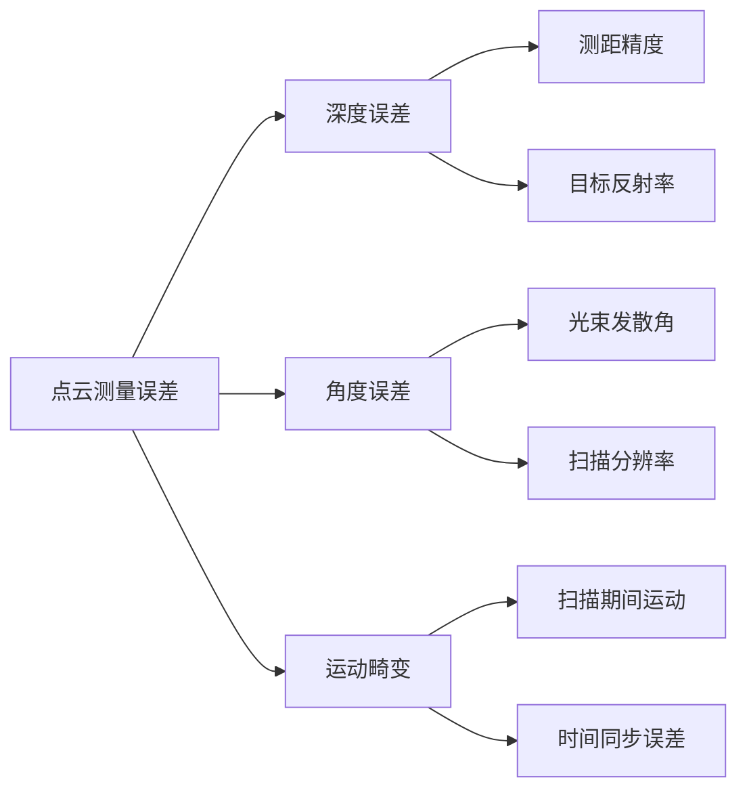

#### 3.2.3 运动畸变校正

激光扫描期间机器人运动会导致点云畸变，需要基于IMU预测进行校正：

$$\mathbf{p}_{corrected} = \mathbf{R}(t)^{-1} (\mathbf{p}_{raw} - \mathbf{t}(t))$$

其中 $\mathbf{R}(t)$ 和 $\mathbf{t}(t)$ 为扫描时刻 $t$ 的位姿预测。

### 3.3 腿部运动学传感器

#### 3.3.1 运动学测量模型

四足机器人通过关节编码器获取足端位置和速度：

**正运动学方程**：

$$\mathbf{p}_{foot} = f_{FK}(\mathbf{q})$$

其中 $\mathbf{q}$ 为关节角度向量。

**雅可比矩阵**：

$$\mathbf{J} = \frac{\partial f_{FK}}{\partial \mathbf{q}}$$

$$\mathbf{v}_{foot} = \mathbf{J} \dot{\mathbf{q}}$$

#### 3.3.2 接触检测

接触状态检测是运动学约束的关键：

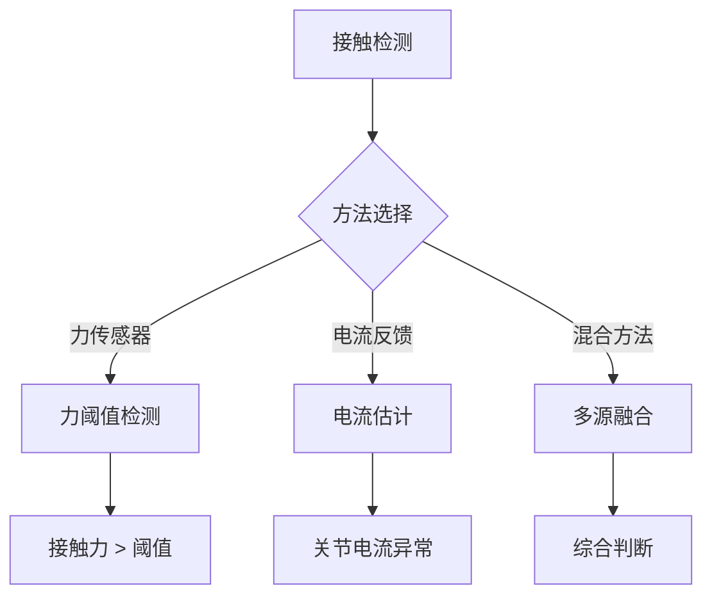

**接触约束方程**：

当足端接触时，满足零速约束：

$$\mathbf{v}_{foot}^{world} = \mathbf{v}_{body} + \boldsymbol{\omega} \times \mathbf{p}_{foot} + \mathbf{R} \mathbf{v}_{foot}^{body} = \mathbf{0}$$

### 3.4 传感器数据特性对比

| 传感器 | 更新频率 | 测量范围 | 误差特性 | 适用场景 |
|--------|---------|---------|---------|---------|
| IMU | 200-1000 Hz | 全范围 | 累积漂移 | 高频运动估计 |
| LiDAR | 10-20 Hz | 视场范围内 | 离散误差 | 结构环境定位 |
| 关节编码器 | 500-1000 Hz | 关节限位 | 量化误差 | 运动学约束 |
| 力传感器 | 100-500 Hz | 量程范围 | 零点漂移 | 接触检测 |

---

## 4. 误差状态卡尔曼滤波器原理

### 4.1 卡尔曼滤波基础

#### 4.1.1 标准卡尔曼滤波

线性系统的状态空间模型：

$$\mathbf{x}_k = \mathbf{F}_k \mathbf{x}_{k-1} + \mathbf{B}_k \mathbf{u}_k + \mathbf{w}_k$$

$$\mathbf{z}_k = \mathbf{H}_k \mathbf{x}_k + \mathbf{v}_k$$

其中：
- $\mathbf{F}_k$：状态转移矩阵
- $\mathbf{H}_k$：观测矩阵
- $\mathbf{w}_k \sim \mathcal{N}(0, \mathbf{Q})$：过程噪声
- $\mathbf{v}_k \sim \mathcal{N}(0, \mathbf{R})$：观测噪声

**预测步骤**：

$$\hat{\mathbf{x}}_{k|k-1} = \mathbf{F}_k \hat{\mathbf{x}}_{k-1|k-1} + \mathbf{B}_k \mathbf{u}_k$$

$$\mathbf{P}_{k|k-1} = \mathbf{F}_k \mathbf{P}_{k-1|k-1} \mathbf{F}_k^T + \mathbf{Q}_k$$

**更新步骤**：

$$\mathbf{K}_k = \mathbf{P}_{k|k-1} \mathbf{H}_k^T (\mathbf{H}_k \mathbf{P}_{k|k-1} \mathbf{H}_k^T + \mathbf{R}_k)^{-1}$$

$$\hat{\mathbf{x}}_{k|k} = \hat{\mathbf{x}}_{k|k-1} + \mathbf{K}_k (\mathbf{z}_k - \mathbf{H}_k \hat{\mathbf{x}}_{k|k-1})$$

$$\mathbf{P}_{k|k} = (\mathbf{I} - \mathbf{K}_k \mathbf{H}_k) \mathbf{P}_{k|k-1}$$

#### 4.1.2 扩展卡尔曼滤波（EKF）

对于非线性系统：

$$\mathbf{x}_k = f(\mathbf{x}_{k-1}, \mathbf{u}_k) + \mathbf{w}_k$$

$$\mathbf{z}_k = h(\mathbf{x}_k) + \mathbf{v}_k$$

通过泰勒展开线性化：

$$\mathbf{F}_k = \left. \frac{\partial f}{\partial \mathbf{x}} \right|_{\hat{\mathbf{x}}_{k-1|k-1}}$$

$$\mathbf{H}_k = \left. \frac{\partial h}{\partial \mathbf{x}} \right|_{\hat{\mathbf{x}}_{k|k-1}}$$

### 4.2 误差状态卡尔曼滤波（ESKF）

#### 4.2.1 ESKF核心思想

ESKF将状态分解为**名义状态（Nominal State）**和**误差状态（Error State）**：

$$\mathbf{x} = \mathbf{x}_{nominal} \boxplus \delta \mathbf{x}$$

**优势分析**：

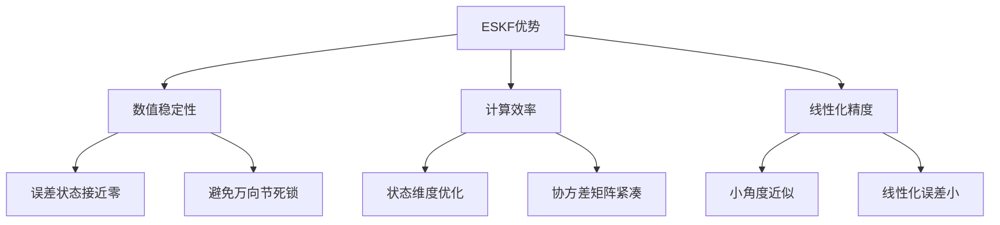

#### 4.2.2 误差状态定义

**旋转误差状态**：

使用李代数表示旋转误差：

$$\mathbf{R} = \mathbf{R}_{nominal} \cdot \text{Exp}(\delta \boldsymbol{\theta})$$

其中 $\text{Exp}(\cdot)$ 为指数映射：

$$\text{Exp}(\boldsymbol{\phi}) = \mathbf{I} + \frac{\sin \|\boldsymbol{\phi}\|}{\|\boldsymbol{\phi}\|} [\boldsymbol{\phi}]_\times + \frac{1 - \cos \|\boldsymbol{\phi}\|}{\|\boldsymbol{\phi}\|^2} [\boldsymbol{\phi}]_\times^2$$

**完整误差状态向量**：

$$\delta \mathbf{x} = \begin{bmatrix} \delta \boldsymbol{\theta} \\ \delta \mathbf{p} \\ \delta \mathbf{v} \\ \delta \mathbf{b}_a \\ \delta \mathbf{b}_g \\ \delta \mathbf{g} \end{bmatrix} \in \mathbb{R}^{18}$$

#### 4.2.3 ESKF vs EKF 对比

| 特性 | EKF | ESKF |
|------|-----|------|
| 状态表示 | 全状态 | 名义状态 + 误差状态 |
| 旋转表示 | 四元数/欧拉角 | 李代数 |
| 线性化精度 | 依赖状态值 | 误差状态接近零 |
| 数值稳定性 | 一般 | 较好 |
| 计算复杂度 | 较高 | 较低 |
| 适用场景 | 一般非线性系统 | 机器人状态估计 |

### 4.3 ESKF框架结构

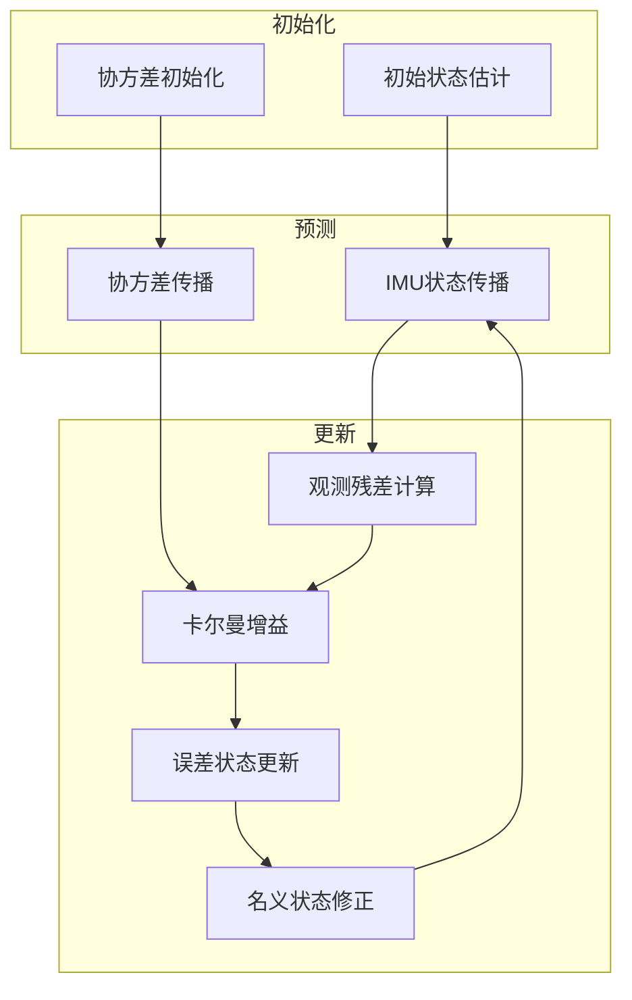

---

## 5. ESKF数学推导与实现

### 5.1 系统状态定义

#### 5.1.1 完整状态向量

Leg-KILO系统采用30维状态向量：

$$\mathbf{x} = \begin{bmatrix} \mathbf{R} & \mathbf{p} & \mathbf{v} & \mathbf{b}_a & \mathbf{b}_g & \mathbf{g} & \mathbf{a}_{imu} & \boldsymbol{\omega}_{imu} & \mathbf{b}_v & \mathbf{p}_c \end{bmatrix}^T$$

**状态分量详解**：

| 索引 | 状态分量 | 符号 | 维度 | 说明 |
|------|---------|------|------|------|
| 0-2 | 旋转误差 | $\delta \boldsymbol{\theta}$ | 3 | SO(3)李代数 |
| 3-5 | 位置误差 | $\delta \mathbf{p}$ | 3 | 世界系位置 |
| 6-8 | 速度误差 | $\delta \mathbf{v}$ | 3 | 世界系速度 |
| 9-11 | 加速度计偏置误差 | $\delta \mathbf{b}_a$ | 3 | 机体系 |
| 12-14 | 陀螺仪偏置误差 | $\delta \mathbf{b}_g$ | 3 | 机体系 |
| 15-17 | 重力误差 | $\delta \mathbf{g}$ | 3 | 世界系 |
| 18-20 | IMU加速度误差 | $\delta \mathbf{a}_{imu}$ | 3 | 测量值 |
| 21-23 | IMU角速度误差 | $\delta \boldsymbol{\omega}_{imu}$ | 3 | 测量值 |
| 24-26 | 运动学偏置误差 | $\delta \mathbf{b}_v$ | 3 | 速度偏置 |
| 27-29 | 接触点误差 | $\delta \mathbf{p}_c$ | 3 | 接触足位置 |

#### 5.1.2 状态更新运算

**状态加法运算**：

$$\mathbf{x} \boxplus \delta \mathbf{x} = \begin{bmatrix} \mathbf{R} \cdot \text{Exp}(\delta \boldsymbol{\theta}) \\ \mathbf{p} + \delta \mathbf{p} \\ \mathbf{v} + \delta \mathbf{v} \\ \mathbf{b}_a + \delta \mathbf{b}_a \\ \mathbf{b}_g + \delta \mathbf{b}_g \\ \mathbf{g} + \delta \mathbf{g} \\ \mathbf{a}_{imu} + \delta \mathbf{a}_{imu} \\ \boldsymbol{\omega}_{imu} + \delta \boldsymbol{\omega}_{imu} \\ \mathbf{b}_v + \delta \mathbf{b}_v \\ \mathbf{p}_c + \delta \mathbf{p}_c \end{bmatrix}$$

**状态减法运算**：

$$\delta \mathbf{x} = \mathbf{x}_2 \boxminus \mathbf{x}_1 = \begin{bmatrix} \text{Log}(\mathbf{R}_1^T \mathbf{R}_2) \\ \mathbf{p}_2 - \mathbf{p}_1 \\ \mathbf{v}_2 - \mathbf{v}_1 \\ \vdots \end{bmatrix}$$

### 5.2 状态转移模型推导

#### 5.2.1 连续时间动力学方程

**旋转动力学**：

$$\dot{\mathbf{R}} = \mathbf{R} \cdot [\boldsymbol{\omega}_{imu}]_\times$$

**位置动力学**：

$$\dot{\mathbf{p}} = \mathbf{v}$$

**速度动力学**：

$$\dot{\mathbf{v}} = \mathbf{R} \cdot \mathbf{a}_{imu} + \mathbf{g}$$

**偏置动力学**（假设偏置为常值加随机游走）：

$$\dot{\mathbf{b}}_a = \mathbf{0}, \quad \dot{\mathbf{b}}_g = \mathbf{0}$$

#### 5.2.2 误差状态动力学

对上述方程进行摄动分析，得到误差状态动力学：

$$\delta \dot{\boldsymbol{\theta}} = -[\boldsymbol{\omega}_{imu}]_\times \delta \boldsymbol{\theta} + \delta \boldsymbol{\omega}_{imu}$$

$$\delta \dot{\mathbf{p}} = \delta \mathbf{v}$$

$$\delta \dot{\mathbf{v}} = -\mathbf{R} [\mathbf{a}_{imu}]_\times \delta \boldsymbol{\theta} + \mathbf{R} \delta \mathbf{a}_{imu} + \delta \mathbf{g}$$

#### 5.2.3 离散化状态转移矩阵

**状态转移矩阵** $\mathbf{F}_x$：

$$\mathbf{F}_x = \begin{bmatrix} 
\text{Exp}(-\Delta t \cdot \boldsymbol{\omega}_{imu}) & \mathbf{0} & \mathbf{0} & \mathbf{0} & \mathbf{0} & \mathbf{0} & \mathbf{0} & \Delta t \cdot \mathbf{I} & \mathbf{0} & \mathbf{0} \\
\mathbf{0} & \mathbf{I} & \Delta t \cdot \mathbf{I} & \mathbf{0} & \mathbf{0} & \mathbf{0} & \mathbf{0} & \mathbf{0} & \mathbf{0} & \mathbf{0} \\
-\Delta t \cdot \mathbf{R} [\mathbf{a}_{imu}]_\times & \mathbf{0} & \mathbf{0} & \mathbf{0} & \mathbf{0} & \Delta t \cdot \mathbf{I} & \Delta t \cdot \mathbf{R} & \mathbf{0} & \mathbf{0} & \mathbf{0} \\
\mathbf{0} & \mathbf{0} & \mathbf{0} & \mathbf{I} & \mathbf{0} & \mathbf{0} & \mathbf{0} & \mathbf{0} & \mathbf{0} & \mathbf{0} \\
\mathbf{0} & \mathbf{0} & \mathbf{0} & \mathbf{0} & \mathbf{I} & \mathbf{0} & \mathbf{0} & \mathbf{0} & \mathbf{0} & \mathbf{0} \\
\mathbf{0} & \mathbf{0} & \mathbf{0} & \mathbf{0} & \mathbf{0} & \mathbf{I} & \mathbf{0} & \mathbf{0} & \mathbf{0} & \mathbf{0} \\
\mathbf{0} & \mathbf{0} & \mathbf{0} & \mathbf{0} & \mathbf{0} & \mathbf{0} & \mathbf{I} & \mathbf{0} & \mathbf{0} & \mathbf{0} \\
\mathbf{0} & \mathbf{0} & \mathbf{0} & \mathbf{0} & \mathbf{0} & \mathbf{0} & \mathbf{0} & \mathbf{I} & \mathbf{0} & \mathbf{0} \\
\mathbf{0} & \mathbf{0} & \mathbf{0} & \mathbf{0} & \mathbf{0} & \mathbf{0} & \mathbf{0} & \mathbf{0} & \mathbf{I} & \mathbf{0} \\
\mathbf{0} & \mathbf{0} & \mathbf{0} & \mathbf{0} & \mathbf{0} & \mathbf{0} & \mathbf{0} & \mathbf{0} & \mathbf{0} & \mathbf{I}
\end{bmatrix}$$

**状态转移函数** $f(\Delta t)$：

$$\delta \mathbf{x} = f(\Delta t) = \begin{bmatrix}
\Delta t \cdot \boldsymbol{\omega}_{imu} \\
\Delta t \cdot \mathbf{v} \\
\Delta t \cdot (\mathbf{R} \cdot \mathbf{a}_{imu} + \mathbf{g}) \\
\mathbf{0} \\
\mathbf{0} \\
\mathbf{0} \\
\mathbf{0} \\
\mathbf{0} \\
\mathbf{0} \\
\mathbf{0}
\end{bmatrix}$$

### 5.3 观测模型推导

#### 5.3.1 点云观测模型

**点-面残差定义**：

$$r_{point} = \mathbf{n}^T (\mathbf{p}_w - \mathbf{c})$$

其中：
- $\mathbf{n}$：平面法向量
- $\mathbf{p}_w$：世界系点坐标
- $\mathbf{c}$：平面中心点

**观测矩阵推导**：

点坐标对状态的雅可比：

$$\frac{\partial \mathbf{p}_w}{\partial \delta \boldsymbol{\theta}} = -\mathbf{R} [\mathbf{p}_i]_\times$$

$$\frac{\partial \mathbf{p}_w}{\partial \delta \mathbf{p}} = \mathbf{I}$$

因此观测矩阵为：

$$\mathbf{H}_{point} = \begin{bmatrix} [\mathbf{p}_i]_\times \mathbf{R}^T \mathbf{n} & \mathbf{n}^T & \mathbf{0} & \cdots & \mathbf{0} \end{bmatrix}$$

#### 5.3.2 IMU观测模型

**加速度观测残差**：

$$r_{acc} = \frac{g}{\|\mathbf{a}_{meas}\|} \mathbf{a}_{meas} - \mathbf{a}_{imu} - \mathbf{b}_a$$

**角速度观测残差**：

$$r_{gyr} = \boldsymbol{\omega}_{meas} - \boldsymbol{\omega}_{imu} - \mathbf{b}_g$$

**观测矩阵**：

$$\mathbf{H}_{imu} = \begin{bmatrix} \mathbf{0} & \mathbf{0} & \mathbf{0} & \mathbf{I} & \mathbf{0} & \mathbf{0} & \mathbf{I} & \mathbf{0} & \mathbf{0} & \mathbf{0} \\
\mathbf{0} & \mathbf{0} & \mathbf{0} & \mathbf{0} & \mathbf{I} & \mathbf{0} & \mathbf{0} & \mathbf{I} & \mathbf{0} & \mathbf{0} \end{bmatrix}$$

#### 5.3.3 运动学观测模型

**接触足零速约束**：

当足端接触时，世界系下足端速度为零：

$$\mathbf{v}_{foot}^{world} = \mathbf{v} + \mathbf{R} (\boldsymbol{\omega} \times \mathbf{p}_{foot} + \mathbf{v}_{foot}^{body}) = \mathbf{0}$$

**残差定义**：

$$r_{kin} = -\mathbf{v} - \mathbf{R} (\boldsymbol{\omega} \times \mathbf{p}_{foot} + \mathbf{v}_{foot}^{body})$$

**观测矩阵推导**：

$$\mathbf{H}_{kin} = \begin{bmatrix} -\mathbf{R} [\boldsymbol{\omega} \times \mathbf{p}_{foot} + \mathbf{v}_{foot}]_\times & \mathbf{0} & \mathbf{I} & \mathbf{0} & \mathbf{0} & \mathbf{0} & \mathbf{0} & -\mathbf{R} [\mathbf{p}_{foot}]_\times & \mathbf{0} & \mathbf{0} \end{bmatrix}$$

### 5.4 协方差传播

#### 5.4.1 过程噪声协方差矩阵

$$\mathbf{Q} = \text{diag}(\mathbf{0}, \mathbf{0}, \sigma_v^2 \mathbf{I}, \sigma_{b_a}^2 \mathbf{I}, \sigma_{b_g}^2 \mathbf{I}, \mathbf{0}, \sigma_a^2 \mathbf{I}, \sigma_\omega^2 \mathbf{I}, \sigma_{b_v}^2 \mathbf{I}, \sigma_{p_c}^2 \mathbf{I})$$

#### 5.4.2 协方差预测

$$\mathbf{P}_{k|k-1} = \mathbf{F}_x \mathbf{P}_{k-1|k-1} \mathbf{F}_x^T + \Delta t^2 \mathbf{Q}$$

#### 5.4.3 协方差更新

$$\mathbf{P}_{k|k} = (\mathbf{I} - \mathbf{K}_k \mathbf{H}_k) \mathbf{P}_{k|k-1}$$

或使用Joseph形式保证对称正定性：

$$\mathbf{P}_{k|k} = (\mathbf{I} - \mathbf{K}_k \mathbf{H}_k) \mathbf{P}_{k|k-1} (\mathbf{I} - \mathbf{K}_k \mathbf{H}_k)^T + \mathbf{K}_k \mathbf{R}_k \mathbf{K}_k^T$$

---

## 6. 算法实现与关键技术细节

### 6.1 系统架构设计

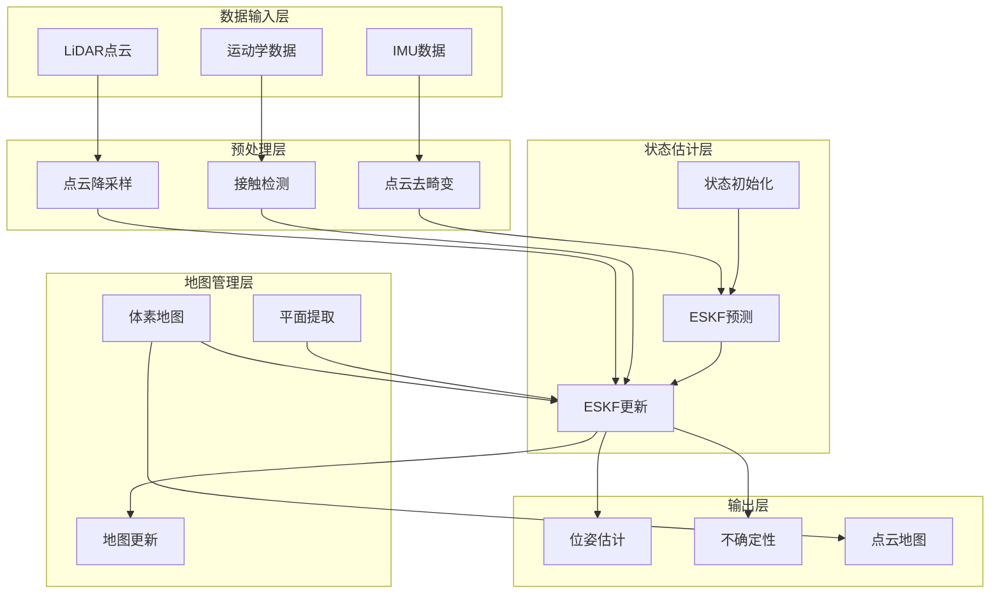

### 6.2 核心算法流程

#### 6.2.1 主处理流程

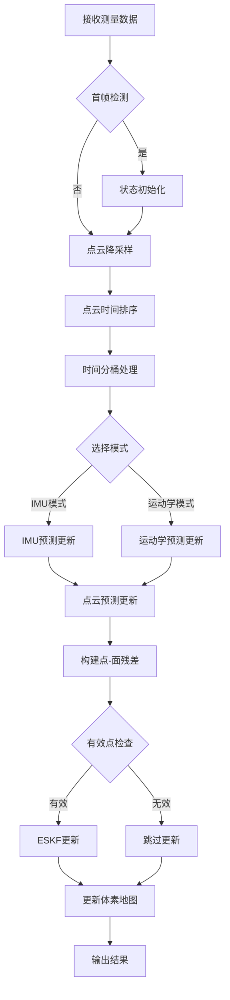

#### 6.2.2 ESKF预测步骤实现

```cpp
void ESKF::predict(double dt, bool prop_state, bool prop_cov) {
    if (prop_state) {
        StateVec delta_x = getFunctionf(dt);
        state_ += delta_x;
    }
    if (prop_cov) {
        StateF Fx = getFx(dt);
        cov_ = Fx * cov_ * Fx.transpose() + (dt * dt) * Q_;
    }
}
```

**关键实现细节**：

1. **状态传播与协方差传播分离**：允许灵活控制更新频率
2. **时间步长处理**：支持变时间步长，适应不同传感器频率
3. **数值稳定性**：协方差矩阵对称化处理

#### 6.2.3 点云观测更新实现

```cpp
void ESKF::updateByPoints(ObsShared& obs_shared) {
    Eigen::MatrixXd PHT = cov_.block<DIM_STATE, 6>(0, 0) * obs_shared.pt_h.transpose();
    Eigen::MatrixXd HPHT_R = obs_shared.pt_h * PHT.topRows(6);
    HPHT_R.diagonal() += obs_shared.pt_R;
    
    Eigen::MatrixXd K = PHT * HPHT_R.inverse();
    StateVec delta_x = K * obs_shared.pt_z;
    
    state_ += delta_x;
    cov_ = cov_ - K * obs_shared.pt_h * cov_.block<6, DIM_STATE>(0, 0);
}
```

### 6.3 体素地图实现

#### 6.3.1 八叉树数据结构

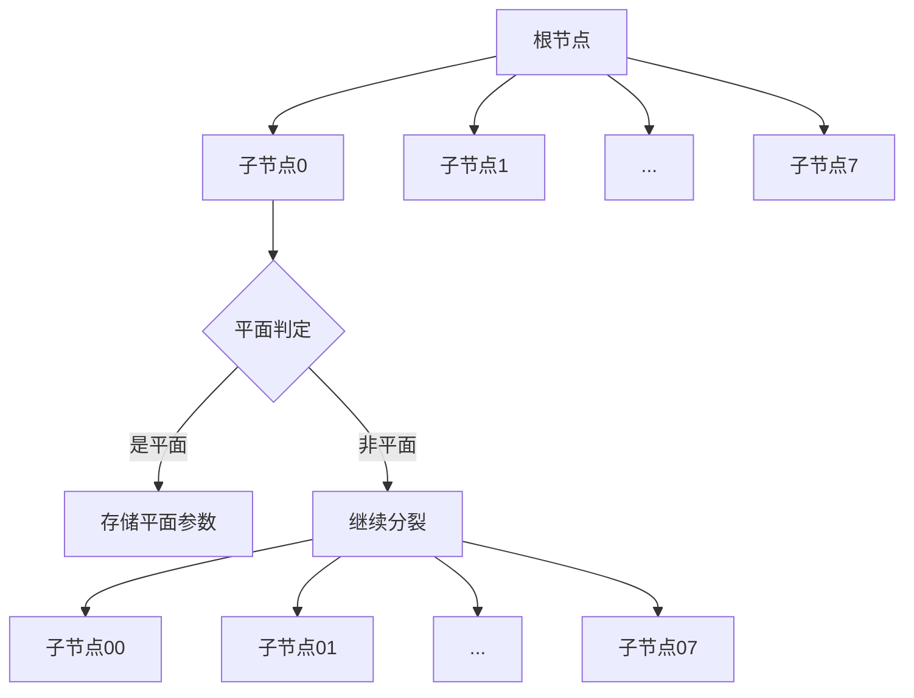

#### 6.3.2 平面拟合算法

**PCA平面拟合**：

1. 计算点云质心：
$$\bar{\mathbf{p}} = \frac{1}{N} \sum_{i=1}^{N} \mathbf{p}_i$$

2. 计算协方差矩阵：
$$\boldsymbol{\Sigma} = \frac{1}{N} \sum_{i=1}^{N} (\mathbf{p}_i - \bar{\mathbf{p}})(\mathbf{p}_i - \bar{\mathbf{p}})^T$$

3. 特征值分解：
$$\boldsymbol{\Sigma} = \mathbf{V} \boldsymbol{\Lambda} \mathbf{V}^T$$

4. 平面法向量：
$$\mathbf{n} = \mathbf{v}_{min}$$

其中 $\mathbf{v}_{min}$ 为最小特征值对应的特征向量。

**平面性判定**：

$$\lambda_{min} < \tau_{plane}$$

### 6.4 状态初始化

#### 6.4.1 静止检测初始化

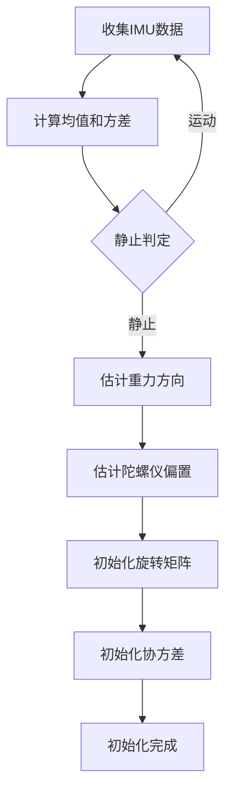

**重力方向估计**：

$$\hat{\mathbf{g}} = -\frac{\bar{\mathbf{a}}}{\|\bar{\mathbf{a}}\|} \cdot g$$

**陀螺仪偏置估计**：

$$\hat{\mathbf{b}}_g = \bar{\boldsymbol{\omega}}$$

### 6.5 关键参数调优

#### 6.5.1 过程噪声参数

| 参数 | 推荐范围 | 调优建议 |
|------|---------|---------|
| `vel_process_cov` | 1e-5 ~ 1e-3 | 值增大，速度响应加快但噪声增加 |
| `acc_bias_process_cov` | 1e-7 ~ 1e-5 | 值增大，偏置收敛加快但稳定性下降 |
| `gyr_bias_process_cov` | 1e-7 ~ 1e-5 | 同上 |

#### 6.5.2 观测噪声参数

| 参数 | 推荐范围 | 调优建议 |
|------|---------|---------|
| `imu_acc_meas_noise` | 1e-3 ~ 1e-1 | 根据IMU精度调整 |
| `kin_meas_noise` | 1e-3 ~ 1e-1 | 根据运动学精度调整 |
| `lidar_point_meas_ratio` | 0.5 ~ 2.0 | 整体缩放点云约束权重 |

---

## 7. 性能分析与算法对比

### 7.1 算法性能评估指标

#### 7.1.1 精度指标

| 指标 | 定义 | 计算方法 |
|------|------|---------|
| 绝对轨迹误差（ATE） | 全局轨迹精度 | $\sqrt{\frac{1}{N}\sum_{i=1}^{N} \|\mathbf{p}_{est,i} - \mathbf{p}_{gt,i}\|^2}$ |
| 相对位姿误差（RPE） | 局部一致性 | $\frac{1}{N}\sum_{i=1}^{N} \|\mathbf{T}_{est,i}^{-1} \mathbf{T}_{est,i+1} - \mathbf{T}_{gt,i}^{-1} \mathbf{T}_{gt,i+1}\|$ |
| 位置漂移 | 长期累积误差 | $\|\mathbf{p}_{end} - \mathbf{p}_{start}\|$ |

#### 7.1.2 效率指标

| 指标 | 说明 | 目标值 |
|------|------|--------|
| 处理延迟 | 单帧处理时间 | < 50ms |
| 内存占用 | 系统内存使用 | < 500MB |
| CPU占用 | 处理器使用率 | < 80% |

### 7.2 与主流算法对比

#### 7.2.1 算法特性对比

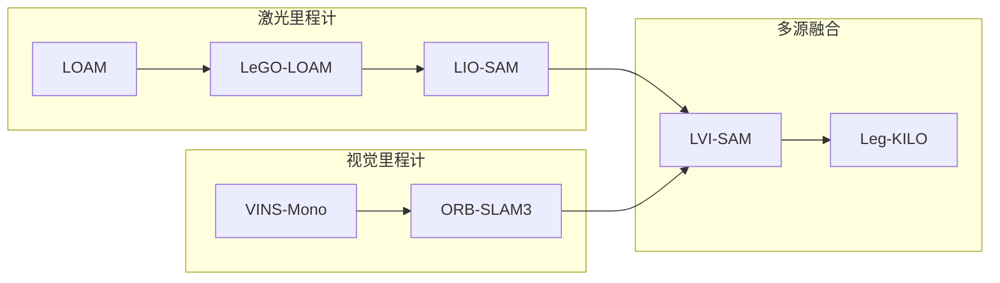

#### 7.2.2 性能对比表

| 算法 | 传感器 | ATE (m) | 频率 (Hz) | 运动学约束 | 适用场景 |
|------|--------|---------|----------|-----------|---------|
| LOAM | LiDAR | 0.05-0.2 | 10 | 否 | 结构环境 |
| LIO-SAM | LiDAR+IMU | 0.02-0.1 | 20 | 否 | 室外大场景 |
| VINS-Mono | 相机+IMU | 0.1-0.5 | 30 | 否 | 纹理丰富环境 |
| LVI-SAM | LiDAR+视觉+IMU | 0.01-0.05 | 15 | 否 | 通用场景 |
| Leg-KILO | LiDAR+IMU+运动学 | 0.01-0.03 | 20 | 是 | 四足机器人 |

### 7.3 适用场景分析

#### 7.3.1 场景分类

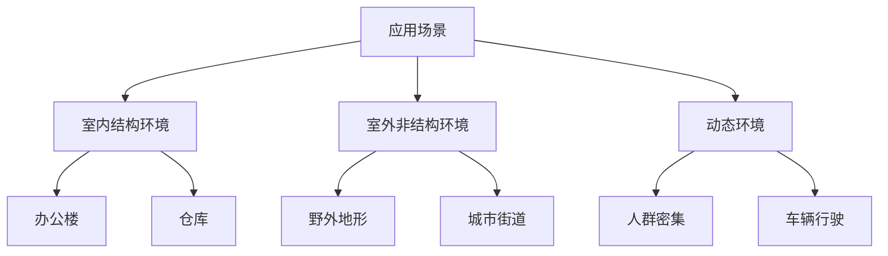

#### 7.3.2 算法选择建议

| 场景特征 | 推荐算法 | 原因 |
|---------|---------|------|
| 结构环境+静态 | LOAM系列 | 几何特征丰富 |
| 纹理丰富环境 | VINS系列 | 视觉特征充足 |
| 光照变化大 | LIO-SAM | 不依赖视觉 |
| 四足机器人 | Leg-KILO | 运动学约束增强 |
| 多机器人协作 | 分布式SLAM | 通信效率 |

### 7.4 计算复杂度分析

#### 7.4.1 时间复杂度

| 模块 | 时间复杂度 | 说明 |
|------|-----------|------|
| IMU预测 | $O(n)$ | $n$为IMU测量数 |
| 点云处理 | $O(m \log m)$ | $m$为点云数量 |
| ESKF更新 | $O(k \cdot d^2)$ | $k$为观测数，$d$为状态维度 |
| 体素地图更新 | $O(m)$ | $m$为点云数量 |

#### 7.4.2 空间复杂度

| 模块 | 空间复杂度 | 说明 |
|------|-----------|------|
| 状态向量 | $O(d)$ | $d=30$ |
| 协方差矩阵 | $O(d^2)$ | $30 \times 30$ |
| 体素地图 | $O(v)$ | $v$为体素数量 |

---

## 8. 结论与展望

### 8.1 主要成果总结

本文档系统阐述了四足机器人状态估计的核心理论与实现方法，主要成果包括：

1. **理论框架**：建立了基于ESKF的完整状态估计理论体系
2. **多源融合**：实现了激光-惯性-运动学的紧耦合融合框架
3. **误差建模**：详细推导了各传感器误差传播模型
4. **工程实现**：提供了高效可复用的算法实现方案

### 8.2 技术创新点

| 创新点 | 描述 | 效果 |
|--------|------|------|
| 运动学约束融合 | 将足端接触约束纳入ESKF框架 | 提高动态运动估计精度 |
| 自适应协方差 | 根据运动状态调整过程噪声 | 增强鲁棒性 |
| 高效体素地图 | 基于八叉树的增量式地图更新 | 降低计算开销 |

### 8.3 未来研究方向

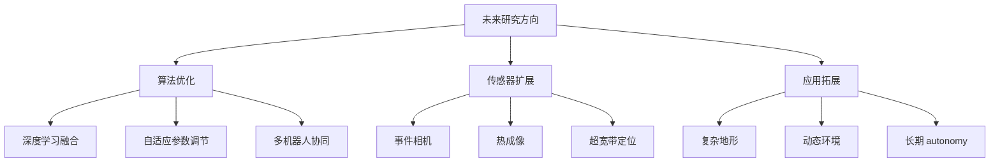

### 8.4 开发建议

1. **参数调优**：根据具体机器人平台和传感器配置调整参数
2. **测试验证**：建立完整的测试数据集和评估流程
3. **持续迭代**：根据实际应用反馈持续优化算法

---

## 参考文献

[1] Solà, J. (2017). Quaternion kinematics for the error-state Kalman filter. *arXiv preprint arXiv:1711.02508*.

[2] Zhang, J., & Singh, S. (2014). LOAM: Lidar Odometry and Mapping in Real-time. *Robotics: Science and Systems Conference*.

[3] Shan, T., Englot, B., Meyers, D., Wang, W., Ratti, C., & Rus, D. (2020). LIO-SAM: Tightly-coupled Lidar Inertial Odometry via Smoothing and Mapping. *IEEE/RSJ International Conference on Intelligent Robots and Systems (IROS)*.

[4] Qin, T., Li, P., & Shen, S. (2018). VINS-Mono: A Robust and Versatile Monocular Visual-Inertial State Estimator. *IEEE Transactions on Robotics*, 34(4), 1004-1020.

[5] Bloesch, M., Hutter, M., Hoepflinger, M. A., Gehring, C., & Siegwart, R. (2013). State estimation for legged robots - consistent fusion of leg kinematics and IMU data. *Robotics: Science and Systems Conference*.

[6] Camurri, M., Bledt, G., Wermelinger, M., Hutter, M., & Fallon, M. (2020). Pronto: A Multi-sensor State Estimator for Legged Robots in Real-world Scenarios. *Frontiers in Robotics and AI*, 7, 68.

[7] Hartley, R., & Ghaffari, M. (2020). Body Frame Control of Dynamic Quadrupedal Locomotion. *IEEE Transactions on Robotics*.

[8] Zheng, C., Zhu, R., Xu, W., & Zhang, F. (2023). FAST-LIVO2: Fast, Direct LiDAR-Inertial-Visual Odometry. *IEEE Transactions on Robotics*.

[9] Forster, C., Pizzoli, M., & Scaramuzza, D. (2014). SVO: Fast semi-direct monocular visual odometry. *IEEE International Conference on Robotics and Automation (ICRA)*.

[10] Mur-Artal, R., & Tardós, J. D. (2017). ORB-SLAM2: An Open-Source SLAM System for Monocular, Stereo, and RGB-D Cameras. *IEEE Transactions on Robotics*, 33(5), 1255-1262.

---

## 附录

### 附录A：数学符号表

| 符号 | 含义 | 维度 |
|------|------|------|
| $\mathbf{R}$ | 旋转矩阵 | 3×3 |
| $\mathbf{p}$ | 位置向量 | 3×1 |
| $\mathbf{v}$ | 速度向量 | 3×1 |
| $\mathbf{b}_a$ | 加速度计偏置 | 3×1 |
| $\mathbf{b}_g$ | 陀螺仪偏置 | 3×1 |
| $\mathbf{g}$ | 重力向量 | 3×1 |
| $\mathbf{P}$ | 协方差矩阵 | 30×30 |
| $\mathbf{Q}$ | 过程噪声协方差 | 30×30 |
| $\mathbf{R}$ | 观测噪声协方差 | m×m |
| $\mathbf{F}_x$ | 状态转移雅可比 | 30×30 |
| $\mathbf{H}$ | 观测矩阵 | m×30 |
| $\mathbf{K}$ | 卡尔曼增益 | 30×m |
| $[\cdot]_\times$ | 反对称矩阵算子 | 3×3 |
| $\text{Exp}(\cdot)$ | 指数映射 | SO(3) |
| $\text{Log}(\cdot)$ | 对数映射 | so(3) |

### 附录B：李群李代数基础

#### B.1 SO(3)群定义

特殊正交群 $SO(3)$ 定义为：

$$SO(3) = \{\mathbf{R} \in \mathbb{R}^{3 \times 3} | \mathbf{R}\mathbf{R}^T = \mathbf{I}, \det(\mathbf{R}) = 1\}$$

#### B.2 李代数 so(3)

$so(3)$ 为 $SO(3)$ 的李代数：

$$so(3) = \{\boldsymbol{\phi} \in \mathbb{R}^3 | [\boldsymbol{\phi}]_\times \in \mathbb{R}^{3 \times 3}\}$$

#### B.3 指数映射

$$\text{Exp}(\boldsymbol{\phi}) = \mathbf{I} + \frac{\sin \theta}{\theta} [\boldsymbol{\phi}]_\times + \frac{1 - \cos \theta}{\theta^2} [\boldsymbol{\phi}]_\times^2$$

其中 $\theta = \|\boldsymbol{\phi}\|$。

#### B.4 对数映射

$$\text{Log}(\mathbf{R}) = \frac{\theta}{2 \sin \theta} (\mathbf{R} - \mathbf{R}^T)^\vee$$

其中 $\theta = \arccos\left(\frac{\text{tr}(\mathbf{R}) - 1}{2}\right)$。

---

*文档版本: 2.0*  
*最后更新: 2026年3月*  
*作者: Leg-KILO项目组*
